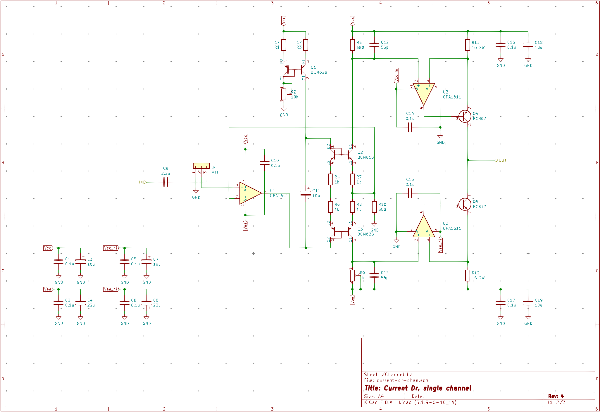

# CURRENT DR.

This is a "current drive" or VCCS class A headphone amplifier. Some advocacy of current drive (as well as a whole book on the topic) can be found at [current-drive.info](https://www.current-drive.info/6).

The first prototype is briefly described on [Prototype](texts/prototype.md) page.

## Schematic

The current version of the schematic is showed below.

Two such channels with a dedicated [linear PSU](texts/psu.md) are going to be fit into an extruded aluminum enclosure with internal dimensions of 96x155x50 mm.
