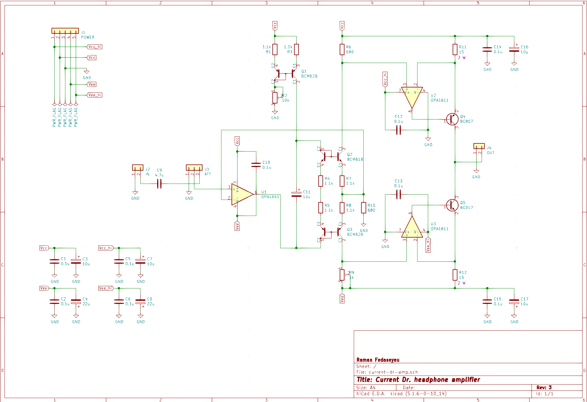

# CURRENT DR.

This is a "current drive" or VCCS class A headphone amplifier. Some advocacy of current drive (as well as a whole book on the topic) can be found at [current-drive.info](https://www.current-drive.info/6).

The first prototype is briefly described on [Prototype](texts/prototype.md) page.

## Schematic

The current version of the schematic is showed below.

Changes comparing to the prototype are:

- supply voltages are set to ±14 V / ±16 V (to power from 12 VAC transformer)
- R4–R9 are updated to match the new supply voltages and fit the commonly available resistor values
- R11–R12 are adjusted so that the output power in a 38 Ω load is about 1 W (can be adjusted to better fit other load, depending on your needs)
- connectors are changed to Molex KK 256

The new PCB is going to be 80x50 mm (twice as little as the prototype board).
