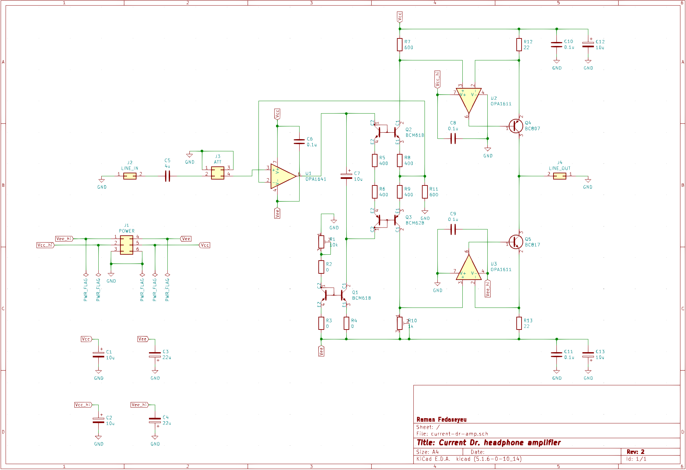

# CURRENT DR.

This is a "current drive" or <abbr title="Voltage Controlled Current Source">VCCS</abbr> (as opposed to "voltage drive" or <abbr title="Voltage Controlled Voltage Source">VCVS</abbr>) headphone amplifier. Some advocacy of current drive (as well as a whole book on the topic) can be found at [current-drive.info](https://www.current-drive.info/6).

## Prototype

A single channel of the Current Dr. amplifier has been prototyped according to the following schematic.

There are a few placeholder components present (R2–R4) and some were added after debugging the prototype (C1–C4).

The initial set-up consists of two operations:

- setting the quiescent current through the reference current sink Q2–Q3 to about 2.5 mA by adjusting R1 and measuring the voltage drop across R5–R6
- setting the output DC offset to a fraction of a mV by adjusting R10 and measuring voltage at the output with a load connected (a resistor of a few hundreds ohm is a suitable load)

The assembled prototype looks like this.

I haven't been able to measure the frequency response, THD, or the output impedance of the prototype yet. Listening to a single channel output suggests it has some potential, hence a proper characterization and development of a standalone stereo amplifier is to be done.
